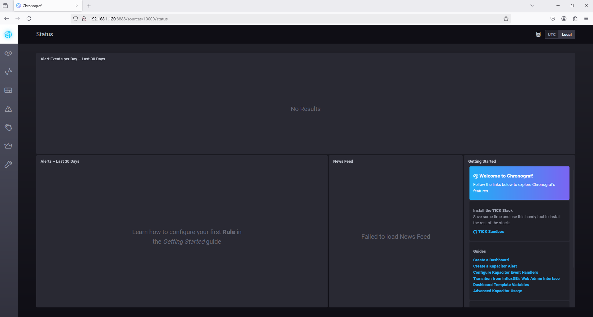

# Домашнее задание к занятию "`Системы мониторинга`" - `Дедюрин Денис`

---
## Задания.

1. Вас пригласили настроить мониторинг на проект. На онбординге вам рассказали, что проект представляет из себя платформу для вычислений с выдачей текстовых отчётов, которые сохраняются на диск. Взаимодействие с платформой осуществляется по протоколу http. Также вам отметили, что вычисления загружают ЦПУ. Какой минимальный набор метрик вы выведите в мониторинг и почему?
2. Менеджер продукта, посмотрев на ваши метрики, сказал, что ему непонятно, что такое RAM/inodes/CPUla. Также он сказал, что хочет понимать, насколько мы выполняем свои обязанности перед клиентами и какое качество обслуживания. Что вы можете ему предложить?
3. Вашей DevOps-команде в этом году не выделили финансирование на построение системы сбора логов. Разработчики, в свою очередь, хотят видеть все ошибки, которые выдают их приложения. Какое решение вы можете предпринять в этой ситуации, чтобы разработчики получали ошибки приложения?
4. Вы, как опытный SRE, сделали мониторинг, куда вывели отображения выполнения SLA = 99% по http-кодам ответов. Этот параметр вычисляется по формуле: summ_2xx_requests/summ_all_requests. Он не поднимается выше 70%, но при этом в вашей системе нет кодов ответа 5xx и 4xx. Где у вас ошибка?
5. Опишите основные плюсы и минусы pull и push систем мониторинга.
6. Какие из ниже перечисленных систем относятся к push модели, а какие к pull? А может есть гибридные?
   - Prometheus
   - TICK
   - Zabbix
   - VictoriaMetrics
   - Nagios
7. Склонируйте себе репозиторий и запустите TICK-стэк, используя технологии docker и docker-compose.
В виде решения на это упражнение приведите скриншот веб-интерфейса ПО chronograf (`http://localhost:8888`).

P.S.: если при запуске некоторые контейнеры будут падать с ошибкой - проставьте им режим `Z`, например `./data:/var/lib:Z`

8. Перейдите в веб-интерфейс Chronograf (http://localhost:8888) и откройте вкладку Data explorer.

   - Нажмите на кнопку `Add a query`
   - Изучите вывод интерфейса и выберите БД telegraf.autogen
   - В measurments выберите cpu->host->telegraf-getting-started, а в fields выберите usage_system. Внизу появится график утилизации cpu.
   - Вверху вы можете увидеть запрос, аналогичный SQL-синтаксису. Поэкспериментируйте с запросом, попробуйте изменить группировку и интервал наблюдений.

Для выполнения задания приведите скриншот с отображением метрик утилизации cpu из веб-интерфейса.

9. Изучите список telegraf inputs. Добавьте в конфигурацию telegraf следующий плагин - docker:
```
[[inputs.docker]]
  endpoint = "unix:///var/run/docker.sock"
```
Дополнительно вам может потребоваться донастройка контейнера telegraf в `docker-compose.yml` дополнительного volume и режима privileged:
```
  telegraf:
    image: telegraf:1.4.0
    privileged: true
    volumes:
      - ./etc/telegraf.conf:/etc/telegraf/telegraf.conf:Z
      - /var/run/docker.sock:/var/run/docker.sock:Z
    links:
      - influxdb
    ports:
      - "8092:8092/udp"
      - "8094:8094"
      - "8125:8125/udp"
```
После настройки перезапустите telegraf, обновите веб интерфейс и приведите скриншотом список `measurments` в веб-интерфейсе базы telegraf.autogen . Там должны появиться метрики, связанные с `docker`.

Факультативно можете изучить какие метрики собирает telegraf после выполнения данного задания.

### Ответ:

1. Так как проект представляет собой вычислительную платформу с HTTP-интерфейсом и высокой нагрузкой на CPU, минимальный набор метрик для мониторинга, по моему мнению, должен включать:

   - Нагрузка на CPU (CPU usage %) – так как вычисления загружают процессор, важно отслеживать его загрузку, чтобы предотвращать перегрузки и зависания.
   - Средняя загрузка процессора (CPU load average, CPUla) – показывает среднее количество процессов, ожидающих CPU. Высокое значение при низком использовании CPU может указывать на блокировки I/O или нехватку ресурсов.
   - Использование памяти (RAM usage %) – если сервис потребляет слишком много памяти, это может привести к OOM (Out of Memory) и сбоям в работе.
   - Использование inode (inodes usage %) – важно, если отчёты хранятся в виде множества мелких файлов. Если inodes заканчиваются, новые файлы не могут быть созданы, даже если есть свободное место на диске.
   - IOPS и latency диска – так как отчёты сохраняются на диск, медленный ввод-вывод может стать узким местом, влияя на производительность сервиса.
   - HTTP-коды ответов – помогает отслеживать ошибки и общую работоспособность API (например, количество 2xx, 4xx, 5xx).
   - Время отклика HTTP (Latency) – ключевой показатель для оценки качества сервиса и удовлетворенности пользователей.
   - Число активных HTTP-запросов – помогает понять текущую нагрузку на сервис, выявлять перегрузки и возможные задержки в обработке запросов.

2. Чтобы донести информацию понятным языком, можно представить метрики в виде бизнес-ориентированных показателей:

   - Доступность сервиса (Uptime %) – сколько времени платформа работала без сбоев.
   - SLA (Service Level Agreement, %) – можно вычислять на основе успешных HTTP-запросов (summ_2xx_requests / summ_all_requests).
   - Среднее время ответа (HTTP latency, ms) – чем меньше задержка, тем лучше для клиентов.
   - Процент успешных вычислений – доля завершённых вычислений без ошибок.
   - Заполненность дискового хранилища – если место заканчивается, платформа может перестать сохранять отчёты, что критично для бизнеса.

Эти метрики помогут менеджеру оценивать качество работы сервиса с точки зрения бизнеса, а технические метрики останутся для команды DevOps и инженеров.

3. Если централизованная система логирования недоступна, можно использовать следующие подходы:

   - Локальное логирование: логи можно писать в файлы и периодически выгружать их разработчикам.
   - Логи в stdout/stderr: если приложения запускаются в Docker или через systemd, можно собирать их стандартными средствами.
   - Webhook на ошибки: отправлять критические ошибки в Slack/Telegram/Webhook-систему.
   - Построить систему сбора логов таким образом, чтоб в неё входили **opensource** решения.

4. Ошибка в формуле вычесления, формула должна выглядеть таким образом:

   `SLA = (summ_2xx_requests + summ_3xx_requests) / summ_all_requests`

5. Плюсы и минусы pull и push систем мониторинга
   | Характеристика            | **Push модель**                          | **Pull модель**                          |
   |---------------------------|------------------------------------------|------------------------------------------|
   | **Описание**              | Агент на сервере отправляет метрики в систему мониторинга. | Система мониторинга регулярно запрашивает данные с агентов. |
   | **Плюсы**                  | - Меньше нагрузки на мониторинговую систему. <br> - Удобно для серверов с ограниченными ресурсами (не требует постоянных соединений). | - Легче контролировать систему мониторинга. <br> - Простой в настройке для одноразовых или редко обновляющихся систем. |
   | **Минусы**                 | - Может быть сложно настроить масштабируемость. <br> - Может возникнуть проблемы с задержками, если агент не успевает отправить данные. | - Нуждается в постоянных запросах, что может создавать нагрузку на сеть и серверы. <br> - Сложнее управлять большими распределёнными системами. |

6. Push-модель
   - TICK

   Pull-модель
   - Prometheus
   - VictoriaMetrics
   - Nagios
   
   Гибридная-модель
   - Zabbix

7. WEB-интерфейс **ПО Chronograf**

   

8. Метрика утилизации cpu

   

9. Изменил docker-compose.yml добавив строку для сервиса **telegraf**:
```
user: telegraf:982
```

Фрагмент файла:

```
  telegraf:
    # Full tag list: https://hub.docker.com/r/library/telegraf/tags/
    build:
      context: ./images/telegraf/
      dockerfile: ./${TYPE}/Dockerfile
      args:
        TELEGRAF_TAG: ${TELEGRAF_TAG}
    image: "telegraf"
    user: telegraf:982
    environment:
      HOSTNAME: "telegraf-getting-started"
    # Telegraf requires network access to InfluxDB
    links:
      - influxdb
    volumes:
      # Mount for telegraf configuration
      - ./telegraf/:/etc/telegraf/
      # Mount for Docker API access
      - /var/run/docker.sock:/var/run/docker.sock
    depends_on:
      - influxdb
```

Презапустил и обновил  страницу. [[inputs.docker]] уже был в конфиге, добавлять не пришлось.

   